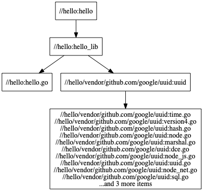

# Bazel を試してみる。

## Bazel は、なんなのか

公式ドキュメントの[Bazel overview](https://docs.bazel.build/versions/3.7.0/bazel-overview.html)、[Bazel vision](https://docs.bazel.build/versions/3.7.0/bazel-vision.html)、[FAQ](https://www.bazel.build/faq.html)あたりを見ると、どういった思想で作られたツールなのかということが、割といろいろ書いてあった。

また、思想的な手がかりとして、 Google 内部でのビルドツールとして開発され、使われているということもヒントになりそうな点である。（ monorepo であることや、非常に規模が大きそうなことなども ）

私の見た感じ、いろいろなところで何度も繰り返し出てくる、いくつかの大事なポイントがあるようだ。

### Bazel がひとつあれば、どんな言語で書かれたプログラムもビルドできる。

> Bazel supports multi-language, multi-platform builds and tests. You can run a single command to build and test your entire source tree, no matter which combination of languages and platforms you target.

> Ant and Maven are primarily geared toward Java, while Bazel handles multiple languages. 

> Bazel provides a uniform, extensible language to define builds for any language or platform.

統一された仕組みで、多くのプロダクトやモジュールのビルドができるというのは、たしかにメリットがありそうに感じる。

### ひとつの書き方で記述したもので、どこでも、同じようにビルドできる。

> High-level build language: Projects are described in the BUILD language, a concise text format that describes a project as sets of small interconnected libraries, binaries and tests. In contrast, with tools like Make, you have to describe individual files and compiler invocations.

> Reproducibility: In BUILD files, each library, test and binary must specify its direct dependencies completely. Bazel uses this dependency information to know what must be rebuilt when you make changes to a source file, and which tasks can run in parallel. This means that all builds are incremental and will always produce the same result.

記述する言語は Starlark という Python？に似たような言語であるが、上記に書かれているように
- 高レベルの言語である。
- コンパイラに特定の処理を実行させる命令のようなものを書くという感じではなく、どちらかというと宣言的に記述させようとする文化なのかもしれない。

Bazel は「ルール」というのを元に内部にサンドボックス環境のようなものを作ってその中でビルドするらしく、例えば go コマンドがPCにインストールされていなくても go のプログラムをビルドできるし、そこで作られたキャッシュは、例えば別のPCに持っていっても使えるらしい。つまり、どの「ルール」を使うかを決めれば、あとはどの環境でも差異が出ないように常にサンドボックス（ローカル環境等の影響が無い環境）でビルドをする仕組みのようである。

ただし、

> In BUILD files, each library, test and binary must specify its direct dependencies completely.

とあるように、おそらく「ルール＋記述＋ソースコード」が常に同じ結果を出力できる代わりにといってはなんだが、それができるだけの情報は記述する必要があるということのようだ。考えてみれば当たり前のことではあるが、他のツールでの具体例は思いつかないのだが「記述は無くてもなんか雰囲気うまくやっておいてくれる」というツールもありそうだし、それはそれでひとつの思想ではあるのだと思う。Bazel は明確に記述が必要なタイプのツールということなのだろう。


### 速いらしい。

> Scalable: Bazel can handle large builds; at Google, it is common for a server binary to have 100k source files, and builds where no files were changed take about ~200ms.

前回のビルドとの差分を認識し、 差分を incremental に、そして parallel にできるところは parallel にビルドする、ということをツール側で自動的にやってくれるらしい。差分であり、並列であることから、高速でもあり、スケーラブルにすることもできるということのようだ。

依存関係を表すツリーというかグラフ構造は、大きなプロジェクトでは果てしなく複雑になりそうではあるが、しかしどちらにせよ、ビルドするためにはそれらの依存関係を解決する必要はあるので、たしかに関係性のグラフ的な構成情報を保持して、前回からの差分と、差分のうちの、並列できる差分とできない差分（グラフ上で直接的な繋がりがあったりしたら並列できないとか、たぶんそういうことなんだと思う）を判別してビルドできる仕組みというのは、なんだか賢そうな気がする。

### その結果、開発者は…

開発者はビルドの心配がいらなくなるということのようである。

- clone しただけでローカルでビルドが必ず動く
  - Bazel でのビルドはローカルにインストールされたソフトウェアやOSによらず、常に同じ結果になる。
- 他のプロジェクトに参加するときも、ビルドのことが障壁にならない
  - Bazel というビルド方法に統一されていれば、他のプログラム言語や別のプラットフォームで動くものであってもすべて、開発者が Bazel を知っているだけで初められる。  
- チームやプロダクトの大きさがとても大きくなっても大丈夫
  - 差分を並列に処理し、キャッシュを持つことで、非常に大きなプロジェクトであっても高速にビルドできる状態が維持される。

### 他のツールとの比較

Bazel がやろうとしていることは少しずつ分かってきた気がするが、しかしその内容やベクトルが、他の新旧のツールとどう違うのかを比較しようとすると、残念なことに私は他のツールのことも良く知らないため、比較ができなかった。


## インストール

[公式ドキュメントの Installing Bazel](https://docs.bazel.build/versions/3.7.0/install.html)の手順でインストールしてみた。
MacOS に信用されていないアプリ的な警告を出される場合に、[ここ](https://github.com/bazelbuild/bazel/issues/9304)にある方法で一時的にその警告が出ないようにすると回避できた。

```shell
❯ bazel --version
bazel 3.7.0
```

## Bazel ＋ Golang で HelloWorld 的なものを動かしてみる

### やったこと

公式のチュートリアルには C++, Java, Android, iOS があるけど、私が普段良く使う言語が Golang なので Go で初めてみたい。

https://github.com/bazelbuild/rules_go

ここにあるのを試すのが良いかなと考えこれを進めることに。

まずは WORKSPACE というファイルに以下のように書くことになる。
```starlark
load("@bazel_tools//tools/build_defs/repo:http.bzl", "http_archive")

http_archive(
    name = "io_bazel_rules_go",
    sha256 = "207fad3e6689135c5d8713e5a17ba9d1290238f47b9ba545b63d9303406209c6",
    urls = [
        "https://mirror.bazel.build/github.com/bazelbuild/rules_go/releases/download/v0.24.7/rules_go-v0.24.7.tar.gz",
        "https://github.com/bazelbuild/rules_go/releases/download/v0.24.7/rules_go-v0.24.7.tar.gz",
    ],
)

http_archive(
    name = "bazel_gazelle",
    sha256 = "b85f48fa105c4403326e9525ad2b2cc437babaa6e15a3fc0b1dbab0ab064bc7c",
    urls = [
        "https://mirror.bazel.build/github.com/bazelbuild/bazel-gazelle/releases/download/v0.22.2/bazel-gazelle-v0.22.2.tar.gz",
        "https://github.com/bazelbuild/bazel-gazelle/releases/download/v0.22.2/bazel-gazelle-v0.22.2.tar.gz",
    ],
)

load("@io_bazel_rules_go//go:deps.bzl", "go_register_toolchains", "go_rules_dependencies")
load("@bazel_gazelle//:deps.bzl", "gazelle_dependencies")

go_rules_dependencies()

go_register_toolchains()

gazelle_dependencies()
```

> load("@bazel_tools//tools/build_defs/repo:http.bzl", "http_archive")

これはたぶん、http_archive （インターネットから bazel のツール群を取得して使うためのもの？）を使うための準備のようだ。

```
http_archive(
    name = "io_bazel_rules_go",
    sha256 = "207fad3e6689135c5d8713e5a17ba9d1290238f47b9ba545b63d9303406209c6",
    urls = [
      "https://mirror.bazel.build/github.com/bazelbuild/rules_go/releases/download/v0.24.7/rules_go-v0.24.7.tar.gz",
      "https://github.com/bazelbuild/rules_go/releases/download/v0.24.7/rules_go-v0.24.7.tar.gz",      
    ],
)
```
ここがきっと、 Go の build を行うための rule を取得しているところ。取得したルールを io_bazel_rules_go という名前で使えるようになるということなのかな。

後半は、取得したツールの中から、準備するためのメソッドを呼び出して、実行しているように見える…。

Go の場合には Gazelle という go.mod から BUILD.bazel を生成するツール？を使うことになりそう（これを使わないと BUILD.bazel を手書きすることになるのだろうか…）


hello.go をこんな感じに書き、
```golang
package main

import (
	"fmt"

	"github.com/google/uuid"
)

func main() {
	fmt.Println("---start---")

	fmt.Printf("test id = [%s]\n", makeUUID())

	fmt.Println("---end---")
}

func makeUUID() string {
	return uuid.New().String()
}
```

go.mod がこんな感じになり、
```go
module github.com/YuichiTanikane/HelloBazel/src

go 1.15

require github.com/google/uuid v1.1.2
```

これを実行すると、
```shell
> bazel run //:gazelle
```

こんな BUILD.bazel ができる。なるほど。
```bazel
load("@io_bazel_rules_go//go:def.bzl", "go_binary", "go_library", "go_test")

go_library(
    name = "hello_lib",
    srcs = ["hello.go"],
    importpath = "github.com/YuichiTanikane/HelloBazel/hello",
    visibility = ["//visibility:private"],
    deps = ["//hello/vendor/github.com/google/uuid"],
)

go_binary(
    name = "hello",
    embed = [":hello_lib"],
    visibility = ["//visibility:public"],
)

go_test(
    name = "hello_test",
    srcs = ["hello_test.go"],
    embed = [":hello_lib"],
)
```

`bazel build` すると、（最初はツール自体の取得等あるようでいろいろ出るがその様子は取り忘れたが、2回目以降は）以下のような感じになった。

```shell
❯ bazel build //hello
INFO: Analyzed target //hello:hello (0 packages loaded, 0 targets configured).
INFO: Found 1 target...
Target //hello:hello up-to-date:
  bazel-bin/hello/hello_/hello
INFO: Elapsed time: 0.414s, Critical Path: 0.01s
INFO: 1 process: 1 internal.
INFO: Build completed successfully, 1 total action
```

`bazel run` でそのまま実行もできる。

```shell
❯ bazel run //hello
INFO: Analyzed target //hello:hello (1 packages loaded, 2 targets configured).
INFO: Found 1 target...
Target //hello:hello up-to-date:
  bazel-bin/hello/hello_/hello
INFO: Elapsed time: 0.381s, Critical Path: 0.02s
INFO: 2 processes: 2 internal.
INFO: Build completed successfully, 2 total actions
INFO: Build completed successfully, 2 total actions
---start---
test id = [642fdb74-a33d-4c76-bcd7-fb33f716880b]
---end---
```

テストもできる（落ちるようにテストを書いている）
```shell
❯ bazel test //hello:hello_test
INFO: Analyzed target //hello:hello_test (0 packages loaded, 21 targets configured).
INFO: Found 1 test target...
FAIL: //hello:hello_test (see /private/var/tmp/_bazel_yuichi/7406fa4e6172bb9fdcc9093f3dd751fb/execroot/__main__/bazel-out/darwin-fastbuild/testlogs/hello/hello_test/test.log)
Target //hello:hello_test up-to-date:
  bazel-bin/hello/hello_test_/hello_test
INFO: Elapsed time: 0.451s, Critical Path: 0.18s
INFO: 3 processes: 2 internal, 1 darwin-sandbox.
INFO: Build completed, 1 test FAILED, 3 total actions
//hello:hello_test                                                       FAILED in 0.1s
  /private/var/tmp/_bazel_yuichi/7406fa4e6172bb9fdcc9093f3dd751fb/execroot/__main__/bazel-out/darwin-fastbuild/testlogs/hello/hello_test/test.log

INFO: Build completed, 1 test FAILED, 3 total actions
```

### 依存関係のグラフ

グラフ形式で依存関係を出力できる。
```
> bazel query --noimplicit_deps  'deps(//hello)' --output graph | dot -Tpng -o test.png
```



この `--noimplicit_deps` というオプションを外すと、たぶん全部のグラフが出るのだが、結構すでに複雑…。


### サンドボックスのようなもｐの
vscode 上で「 bazel-* 」というフォルダ名で見えているものは、たしかになんだか、サンドボックスっぽいものへのシンボリックリンクになっているようだった。

```shell
drwxr-xr-x  11 yuichi  staff   352B Nov 24 16:01 .git
-rw-r--r--   1 yuichi  staff    10B Nov 24 17:31 .vscodeignore
-rw-r--r--   1 yuichi  staff   125B Nov 24 16:56 BUILD.bazel
-rw-r--r--   1 yuichi  staff    12K Nov 24 22:37 README.md
-rw-r--r--   1 yuichi  staff   1.1K Nov 24 16:48 WORKSPACE
lrwxr-xr-x   1 yuichi  staff    81B Nov 24 16:56 bazel-HelloBazel -> /private/var/tmp/_bazel_yuichi/7406fa4e6172bb9fdcc9093f3dd751fb/execroot/__main__
lrwxr-xr-x   1 yuichi  staff   112B Nov 24 16:56 bazel-bin -> /private/var/tmp/_bazel_yuichi/7406fa4e6172bb9fdcc9093f3dd751fb/execroot/__main__/bazel-out/darwin-fastbuild/bin
lrwxr-xr-x   1 yuichi  staff    91B Nov 24 16:56 bazel-out -> /private/var/tmp/_bazel_yuichi/7406fa4e6172bb9fdcc9093f3dd751fb/execroot/__main__/bazel-out
lrwxr-xr-x   1 yuichi  staff   117B Nov 24 16:56 bazel-testlogs -> /private/var/tmp/_bazel_yuichi/7406fa4e6172bb9fdcc9093f3dd751fb/execroot/__main__/bazel-out/darwin-fastbuild/testlogs
drwxr-xr-x   8 yuichi  staff   256B Nov 24 17:16 hello
-rw-r--r--   1 yuichi  staff    40K Nov 24 17:52 test.png
```


### 思ったこと

- Bazel がローカルの go を使っていないとすると、たしかに `rules_go-v0.24.7` ということ以外には「ビルドの仕組み」を指定する具体的なことは指定していない気がして、なるほどそういう感じなのか、という気がした。
  - rule というのは自作もできるようではあるが、メジャーなプログラム言語に関しては公式で出ている rule を使う感じになるのだろう。
- 依存に関する情報をすべて記載する必要がある感じも、そういう感じなのねという雰囲気は少しわかった。
- Go の場合、 Gazelle や vendor のあたりが、なんかいまいちスッキリしない（ go mod vendor 的な依存解決もしつつ、 Bazel も依存管理をしている感じというか…）ような気もする。
- 依存解決という意味では、 `BUILD.bazel` にかかれている uuid のライブラリの記述は

```
deps = ["//hello/vendor/github.com/google/uuid"],
```

であり、 `go.mod` に書かれている `github.com/google/uuid v1.1.2` から情報が減っているような気がするし、結局 `go mod vendor` で配置した uuid を使っている気がするのでなんか不思議な気持ちもする。

- キャッシュを使うことで高速化されているので、 CI サーバー（ TravisCI や GitHub Actions など）で使うには、`actions/cache` のようなものなど、キャッシュを使える状態にして使うべきなのだろう。